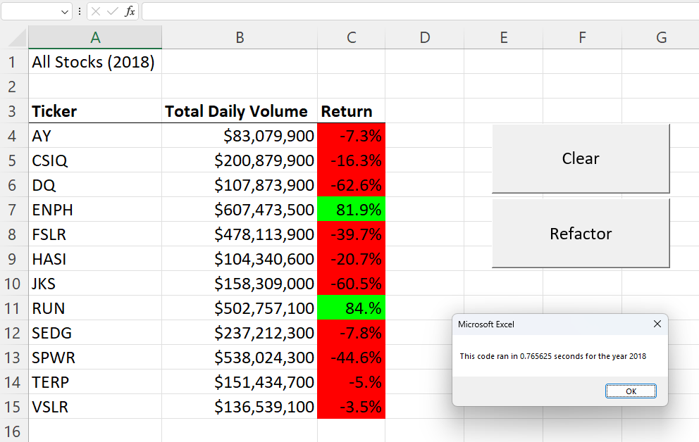
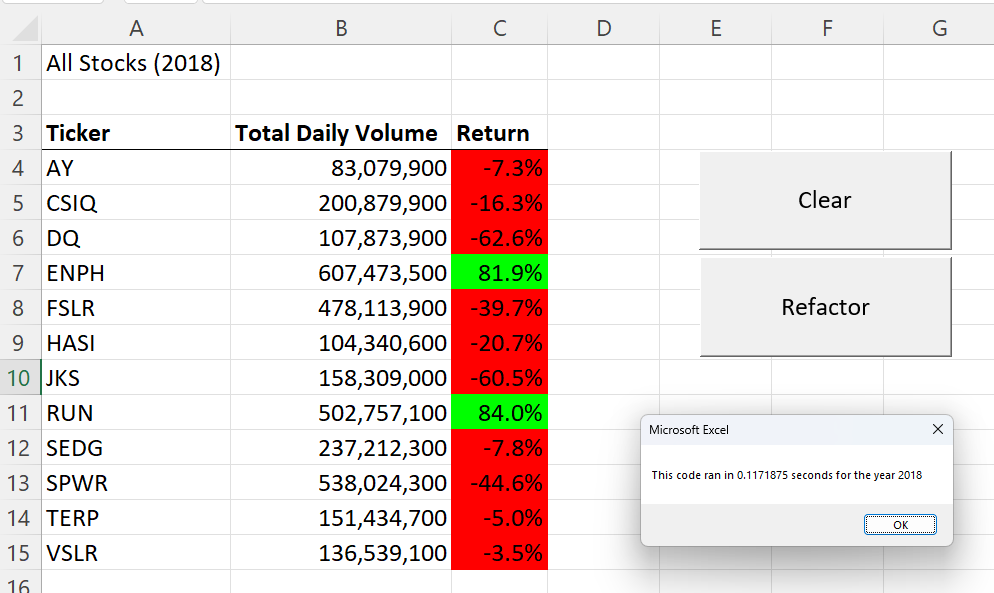

# An Analysis Review of Green Stocks VBA Refactored Code

### Green Stocks VBA Refactor Analysis Project Overview

This README analysis of refactoring VBA (*Visual Basic for Applications*) code in the attached Green Stocks Excel document for the year of 2018 and determining if there were any gained efficiencies in making the VBA script run faster.  In this analysis, there will be the original and refactored code for comparisons to showcase what was utilized during the refactoring along with images of the timer before and post-refactoring.

### Purpose and Background

#### Purpose

This code refactoring aims to ensure that the client who requested the Green Stocks Excel document to showcase certain stock information can be analyzed with the given datasets efficiently without taking a lot of time to process.  Additionally, a request has been made to analyze not only one year's worth of data, but multiple years, and along with buttons inside the Excel document for ease of use.

#### Background

The client for which this refactoring has been completed for is a recent graduate, Steve, who has attained his finance degree.  His parents are requesting Steve about investment opportunities in green energy companies for diversification of funds.  The Green Stocks Excel document was given by Steve for help in analyzing the data, and in good faith to be used as a repeatable product in future years as more data is collected.  VBA was chosen as the programming language to accurately perform calculations for the analysis of data by interacting with Excel.  This also allows additional datasets to be included when available from the client without further knowledge of using Excel's internal formulas.  This is accomplished by having scripts able to run in the background with the push of a button and input by the client for ease of use.

### Results

To answer directly, there was an improvement between the original and refactored code by a 145% difference between the two codes. The original code ran at 0.7382813 seconds, and the refactored at 0.1171875 seconds which can be seen in **Figure 1**.

**Figure 1**: "VBA_Challenge_2018"
	

In the above figure, please note that the refactored code also was able to incorporate more complexity such as formatting and highlighting of cells while gaining significant improvement in the efficiency of processing the data.  How this was accomplished was by using the variable called 'tickerIndex' and incorporating it's use to hold data and distribute the stored data efficiently when called upon within the refactored script.

**Figure 2**: "Original Code"

	Sub AllStocksAnalysis()

	Dim startTime As Single
	Dim endTime As Single
	yearValue = InputBox("What year would you like to run the analysis on?")

	startTime = Timer

	'1) Format the output sheet on the "All Stocks Analysis" worksheet.
	Worksheets("All Stocks Analysis").Activate

	Range("A1").Value = "All Stocks (2018)"

	'Create a header row
	Cells(3, 1).Value = "Ticker"
	Cells(3, 2).Value = "Total Daily Volume"
	Cells(3, 3).Value = "Return"

	'2) Initialize an array of all tickers.
	Dim tickers(11) As String

	tickers(0) = "AY"
	tickers(1) = "CSIQ"
	tickers(2) = "DQ"
	tickers(3) = "ENPH"
	tickers(4) = "FSLR"
	tickers(5) = "HASI"
	tickers(6) = "JKS"
	tickers(7) = "RUN"
	tickers(8) = "SEDG"
	tickers(9) = "SPWR"
	tickers(10) = "TERP"
	tickers(11) = "VSLR"

	'3) Prepare for the analysis of tickers.
	'a) Initialize variables for the starting price and ending price.
	    Dim startingPrice As Double
	    Dim endingPrice As Double

	    'b) Activate the data worksheet.
	    Worksheets("2018").Activate

	    'c) Find the number of rows to loop over.
	    RowCount = Cells(Rows.Count, "A").End(xlUp).Row

	'4) Loop through the tickers.
	For i = 0 To 11
	   ticker = tickers(i)
	   totalVolume = 0

	    '5) Loop through rows in the data.
	    Worksheets("2018").Activate

	    For j = 2 To RowCount

		'a) Find the total volume for the current ticker.
		If Cells(j, 1).Value = ticker Then
		    totalVolume = totalVolume + Cells(j, 8).Value
		End If

		'b) Find the starting price for the current ticker.
		If Cells(j - 1, 1).Value <> ticker And Cells(j, 1).Value = ticker Then
		    startingPrice = Cells(j, 6).Value
		End If

		'c) Find the ending price for the current ticker.
		If Cells(j + 1, 1).Value <> ticker And Cells(j, 1).Value = ticker Then
		    endingPrice = Cells(j, 6).Value
		End If

	    Next j

	'6) Output the data for the current ticker.
	Worksheets("All Stocks Analysis").Activate
	Cells(4 + i, 1).Value = ticker
	Cells(4 + i, 2).Value = totalVolume
	Cells(4 + i, 3).Value = endingPrice / startingPrice - 1

	Next i

	    endTime = Timer
	    MsgBox "This code ran in " & (endTime - startTime) & " seconds for the year " & (yearValue)

	End Sub

**Figure 3**

	Sub AllStocksAnalysisRefactored()

	    'Variables for running a timer at the beginning and end of this code to measure efficiency
	    Dim startTime As Single
	    Dim endTime  As Single

	    'Ask for the user's input on what year to run the analysis
	    yearValue = InputBox("What year would you like to run the analysis on?")

	    'Utilizing the Timer function within VBA to create a value for the startTime and endTime variables
	    startTime = Timer

	    'Format the output sheet on All Stocks Analysis worksheet
	    Worksheets("All Stocks Analysis").Activate

	    'Create a title w/ year inputted from user in the very first cell
	    Range("A1").Value = "All Stocks (" + yearValue + ")"

	    'Create a header row, for row 3 columns A, B, and C
	    Cells(3, 1).Value = "Ticker"
	    Cells(3, 2).Value = "Total Daily Volume"
	    Cells(3, 3).Value = "Return" 'Column 6 in sheet 2018 helps calculate this

	    'Initialize array of all tickers
	    'This is forcing rows 4 through 15 in column A to use these predetermined ticker names
	    Dim tickers(11) As String

	    tickers(0) = "AY"
	    tickers(1) = "CSIQ"
	    tickers(2) = "DQ"
	    tickers(3) = "ENPH"
	    tickers(4) = "FSLR"
	    tickers(5) = "HASI"
	    tickers(6) = "JKS"
	    tickers(7) = "RUN"
	    tickers(8) = "SEDG"
	    tickers(9) = "SPWR"
	    tickers(10) = "TERP"
	    tickers(11) = "VSLR"

	    'Activate data worksheet
	    Worksheets(yearValue).Activate

	    'Get the number of rows to loop over
	    RowCount = Cells(Rows.Count, "A").End(xlUp).Row

	    '1a) Create a ticker Index
	    Dim tickerIndex As Integer
	    'Setting the ticker volume to equal 0 (zero)
	    tickerIndex = 0

	    '1b) Create three output arrays
	    Dim tickerVolumes(11) As Long
	    Dim tickerStartingPrices(11) As Single
	    Dim tickerEndingPrices(11) As Single

	    '2a) Create a For loop to initialize the tickerVolumes to zero

	    'Augmenting and reusing the code from Module 2 assignment, "loop through tickers"
	    For i = 0 To 11
		'Had to get help w/ understanding assigning values to the end of arrays.
		'Every time tickerVolumes goes through a loop by referencing "i" initialize to zero
		tickerVolumes(i) = 0
	    'End the For (loop)
	    Next i

	    '2b) Loop over all the rows in the spreadsheet

	    'Start at row 2 in column "A" from the RowCount variable
	    For i = 2 To RowCount

		'3a) Increase volume for current ticker

		'Had to utilize the hint given in the challenge
		'tickerVolumes will reference tickerIndex as the index, which was given a value of 0
		'in the = portion, tickerVolumes will pull to a value of 0 then add values starting at row 2 until the last row applicable by .End(xlUp).Row
		'The number 8 represents column H in the given sheet and pulls the value in each respective cell
		tickerVolumes(tickerIndex) = tickerVolumes(tickerIndex) + Cells(i, 8).Value

		'3b) Check if the current row is the first row with the selected tickerIndex.
		'Augmenting and reusing the code from Module 2 assignment, "get total volume for current ticker"
		'Had to get help w/ the incorporation of using tickerIndex for this to work for both starting and ending

		'If  Then
		'This conditional statement checks through all the tickers and move to the next ticker when applicable
		If Cells(i - 1, 1).Value <> tickers(tickerIndex) And Cells(i, 1).Value = tickers(tickerIndex) Then
		    'The found starting price per ticker will then be stored in the tickerStartingPrices(tickerIndex)
		    tickerStartingPrices(tickerIndex) = Cells(i, 6).Value

		'End If
		End If

		'3c) check if the current row is the last row with the selected ticker
		'If the next row’s ticker doesn’t match, increase the tickerIndex.

		'If Then
		'This conditional statement checks through all the tickers and move to the next ticker when applicable
		If Cells(i + 1, 1).Value <> tickers(tickerIndex) And Cells(i, 1).Value = tickers(tickerIndex) Then
		    'The found ending price per ticker will then be stored in the tickerStartingPrices(tickerIndex)
		    tickerEndingPrices(tickerIndex) = Cells(i, 6).Value

		    '3d Increase the tickerIndex
		    'Had to get help to understand this component
		    'tickerIndex will equal itself based on what was last pulled and add one to force the script to view the next ticker
		    tickerIndex = tickerIndex + 1

		'End If
		End If

	    'End Loop
	    Next i

	    '4) Loop through your arrays to output the Ticker, Total Daily Volume, and Return.

	    'Loop for output print to "All Stock Analysis"
	    For i = 0 To 11

		'Activate "All Stocks Analysis" sheet
		Worksheets("All Stocks Analysis").Activate

		'Assigning values
		'Had to get help. All of these are arrays, which must have an assignment following them in parentheses
		'Augmenting and reusing code from the Module 2 assignment, "Output data for current ticker"
		Cells(4 + i, 1).Value = tickers(i)
		Cells(4 + i, 2).Value = tickerVolumes(i)
		Cells(4 + i, 3).Value = tickerEndingPrices(i) / tickerStartingPrices(i) - 1

	    'End Loop
	    Next i

	    'Formatting
	    Worksheets("All Stocks Analysis").Activate
	    'Boldens cells A3, B3, and C3
	    Range("A3:C3").Font.FontStyle = "Bold"
	    'Border thickness and line style seen between rows 3 and 4
	    Range("A3:C3").Borders(xlEdgeBottom).LineStyle = xlContinuous
	    'Formats the Total Daily Volume column numbers to use comma's
	    Range("B4:B15").NumberFormat = "#,##0"
	    'Formats the Return column numbers to be used as percentages and ends at the tenths place
	    Range("C4:C15").NumberFormat = "0.0%"
	    'Acts as a double click between columns to shrink or expand the cells to show given data properly
	    Columns("B").AutoFit

	    'Creating the row start and end values
	    dataRowStart = 4
	    dataRowEnd = 15

	    'Loop to highlight the cells either green or red based on if the percent is greater than zero or not
	    For i = dataRowStart To dataRowEnd

		If Cells(i, 3) > 0 Then
		    Cells(i, 3).Interior.Color = vbGreen
		Else
		    Cells(i, 3).Interior.Color = vbRed
		End If

	    Next i

	    'Ends the time clock and produces a message of the result of the year (sheet) ran.
	    endTime = Timer
	    MsgBox "This code ran in " & (endTime - startTime) & " seconds for the year " & (yearValue)

	End Sub

	
### Summary

#### Advantages and Disadvantages of Refactoring Code

**Advantages**

- Allows for higher levels of efficiency which uses less memory for a device and allows for more streamlined processing.
- Rewriting code by adding comments to help explain the logic behind why a certain portion was written for easier recall of the original writer or for anyone who may have to augment the code later.

**Disadvantages**

- Takes a significant amount of commitment to identify areas for improvement where the time in refactoring must be considered.
- May introduce lengthier portions of complexity that may make it difficult for use in future adaptations or potentially add unwanted bugs that were unforeseen.

#### Advantages and Disadvantages of the Original and Refactored VBA Script

**Advantages**

- With the increase of efficiency between the original and refactored VBA script, more tickers can be added without significant felt impact to the user if new datasets would be introduced.
- Refactoring allowed another opportunity to add more comments into the code to really explain what was happening with each line.  In the original, I had to constantly go back into the Module 2 information to re-study and understand what a specific portion was doing even after leaving it for a day or two.  The recall was much quicker by having a comment block.

**Disadvantages**

- Significant amount of time, researching, and requesting help went into an efficiency that was very unnoticable to the human user.

